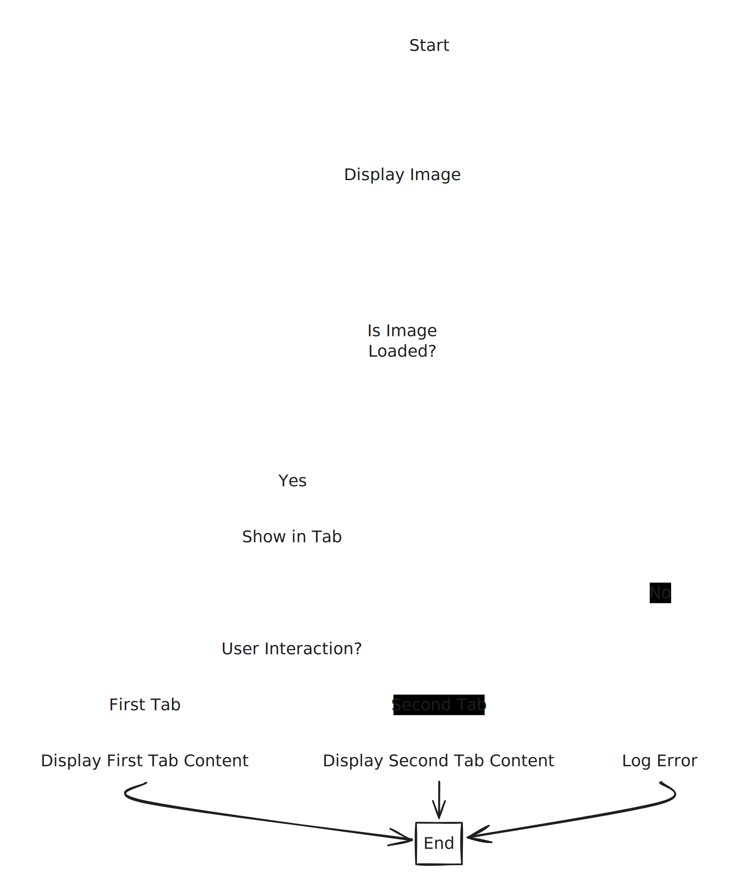

# Page 1

<table data-view="cards"><thead><tr><th></th><th data-hidden data-card-cover data-type="image">Cover image</th></tr></thead><tbody><tr><td></td><td><a href="https://upload.wikimedia.org/wikipedia/commons/thumb/f/f5/Typescript.svg/1200px-Typescript.svg.png">https://upload.wikimedia.org/wikipedia/commons/thumb/f/f5/Typescript.svg/1200px-Typescript.svg.png</a></td></tr><tr><td></td><td><a href="https://upload.wikimedia.org/wikipedia/commons/thumb/f/f5/Typescript.svg/1200px-Typescript.svg.png">https://upload.wikimedia.org/wikipedia/commons/thumb/f/f5/Typescript.svg/1200px-Typescript.svg.png</a></td></tr></tbody></table>













### asdf

asdfasdf



### asdfasdf

asdfasd





asdfasdf



asdfasdf



asdfasdfasdfasdf



